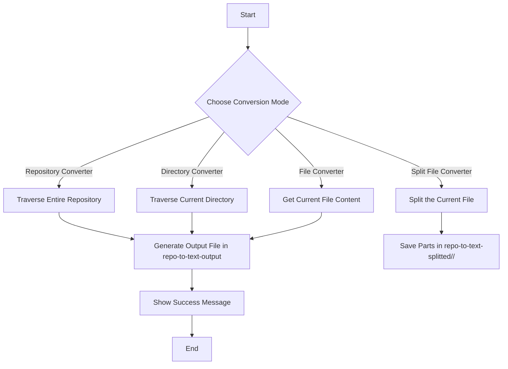

Aqui está a versão atualizada do README para o seu plugin "Dir to Text Converter", com as informações sobre a nova funcionalidade de divisão de arquivos e estrutura de diretórios:

---

# Dir to Text Converter

This is a simple tool to transform an entire directory into a single text format, making it easier to use with AI generator models.

## Technologies Used

- **Visual Studio Code API**: For integrating with the VS Code environment.
- **TypeScript**: For writing type-safe code.
- **Node.js**: For running the extension and its dependencies.
- **Webpack**: For bundling the extension's code.
- **Mermaid**: For generating diagrams to visualize the functionality.

## Functionality Diagram



## Requirements

Before you begin, ensure you have the following installed:

- **Node.js** (version 14.x or higher)
- **npm** (comes with Node.js)
- **Visual Studio Code**
- **Yo (Yeoman)** for scaffolding the project

You can install `Yo` globally using npm:

```bash
npm install -g yo
```

## Generating the Base Content

To generate the base content for the extension, you can use the following commands:

1. Open a terminal and run:
   ```bash
   yo code
   ```
2. Follow the prompts to set up your extension:
   - Choose the type of extension you want to create (e.g., TypeScript).
   - Provide a name, description, and other settings as prompted.
3. This will create the basic structure of the extension in a new directory.

## Manual Installation and Usage

### Cloning the Repository

1. Clone the repository:
   ```bash
   git clone https://github.com/username/dir-to-text-converter.git
   cd dir-to-text-converter
   ```

2. Install dependencies:
   ```bash
   npm install
   ```

3. Open the project in Visual Studio Code:
   ```bash
   code .
   ```

### Running the Extension Locally Without Packaging

1. Press `F5` to run the extension in a new VS Code window.
2. Open the Command Palette (Ctrl + Shift + P).
3. Type and select one of the following commands:
   - **repository-converter**: Converts the entire repository into a text file.
   - **dir-converter**: Converts only the current directory into a text file.
   - **file-converter**: Converts only the currently opened file into a text file.
   - **split-file**: Splits the currently opened file into smaller parts and saves them in a structured folder.

### Packaging the Extension Locally

To package the extension for publishing:

1. Run the following command in the terminal:
   ```bash
   vsce package
   ```

This will create a `.vsix` file in the root directory.

### Installing the Packaged Extension

1. Open Visual Studio Code.
2. Go to the Extensions section (Ctrl + Shift + X).
3. Click on the three dots in the top-right corner and select "Install from VSIX..."
4. Choose the `.vsix` file created in the previous step.

## Using the Extension After Installation

1. After installing, open the Command Palette (Ctrl + Shift + P).
2. Type and select one of the following commands:
   - **repository-converter**: Converts the entire repository into a text file.
   - **dir-converter**: Converts only the current directory into a text file.
   - **file-converter**: Converts only the currently opened file into a text file.
   - **split-file**: Splits the currently opened file into smaller parts.
3. The output will be saved in:
   - A file named `<name>-<timestamp>.txt` inside the `repo-to-text-output` directory for standard conversions.
   - A structured directory `repo-to-text-splitted/<original-file-name>/` for split files.

## Publishing the Extension

To publish the extension, ensure you have a Visual Studio Marketplace account and run:

```bash
vsce publish
```

You may need to log in to your Azure DevOps account if prompted.

## Contribution

Feel free to contribute improvements. Open a pull request or an issue to discuss changes.

## License

This project is licensed under the terms specified in the [LICENSE](LICENSE) file.

---

Sinta-se à vontade para ajustar qualquer parte do README conforme necessário! Se precisar de mais alguma coisa, estou à disposição.