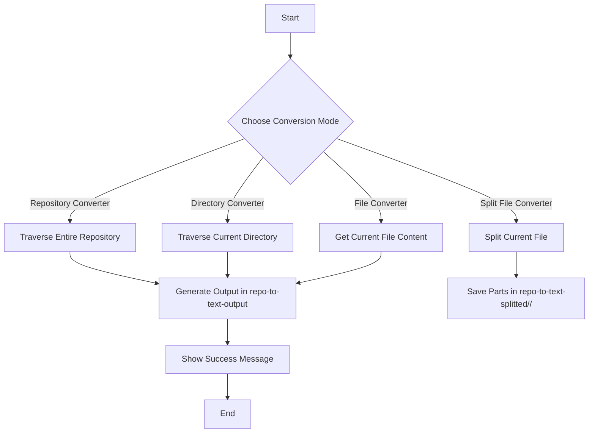

# Dir to Text Converter

A simple tool to convert directories, repositories, and individual files into a text or YAML format. This makes it easier to work with repository contents in AI-assisted applications or content analysis tools.

## Usage Example for Generated Files

A potential use case for the YAML format output is outlined below. You can send the YAML file to language models with prompts like this:

```
"Here is a YAML file representing the repository. If I request a change in a specific section, return only that complete section with the requested change. Do not return the entire file. Here is the current YAML:

[YAML Content]

Now, update the [SECTION NAME] section to include [DETAIL OF THE CHANGE]."
```

## Key Features

- **Repository Conversion**: Converts an entire repository to a text file, with each path as a key and the file contents as the value.
- **Directory Conversion**: Converts only the contents of the current directory.
- **File Conversion**: Converts only the currently open file.
- **Split File Conversion**: Splits a large file into smaller parts for easy processing, saving them within a structured output directory.

## Technologies Used

- **Visual Studio Code API**: For seamless integration within VS Code.
- **TypeScript**: For type-safe, scalable code.
- **Node.js**: For managing the extension runtime.
- **Webpack**: For efficient bundling.
- **Mermaid**: For generating diagrams to visualize plugin functionality.

## Functionality Diagram



## Requirements

Ensure you have the following installed:

- **Node.js** (14.x or higher)
- **npm** (bundled with Node.js)
- **Visual Studio Code**
- **Yeoman (Yo)** for project scaffolding

Install `Yeoman` globally if needed:

```bash
npm install -g yo
```

## Initial Setup and Installation

### Clone the Repository

```bash
git clone https://github.com/username/dir-to-text-converter.git
cd dir-to-text-converter
```

### Install Dependencies

```bash
npm install
```

### Open the Project in Visual Studio Code

```bash
code .
```

## Running the Extension Locally

1. Press `F5` to launch the extension in a new VS Code window.
2. Open the Command Palette (`Ctrl + Shift + P`).
3. Choose from these commands:
   - **repository-converter**: Convert the whole repository.
   - **dir-converter**: Convert only the current directory.
   - **file-converter**: Convert only the current file.
   - **split-file**: Split the current file into smaller parts for easy processing.

## Packaging the Extension for Publishing

To create a `.vsix` file for distribution:

```bash
vsce package
```

### Install the Packaged Extension

1. In VS Code, navigate to Extensions (`Ctrl + Shift + X`).
2. Click the three dots in the top-right, select **Install from VSIX...**, and choose your `.vsix` file.

## Post-Installation Usage

1. Open the Command Palette (`Ctrl + Shift + P`).
2. Choose a command:
   - **repository-converter**
   - **dir-converter**
   - **file-converter**
   - **split-file**
3. The output is saved in:
   - `repo-to-text-output` for standard conversions.
   - `repo-to-text-splitted/<original-file-name>/` for split files.

## Publishing the Extension

To publish to the Visual Studio Marketplace:

```bash
vsce publish
```

You may be prompted to log in to your Azure DevOps account.

## Contributing

Contributions are welcome! Open a pull request or issue to suggest improvements or report bugs.

## License

This project is licensed under the [LICENSE](LICENSE) file.

--- 